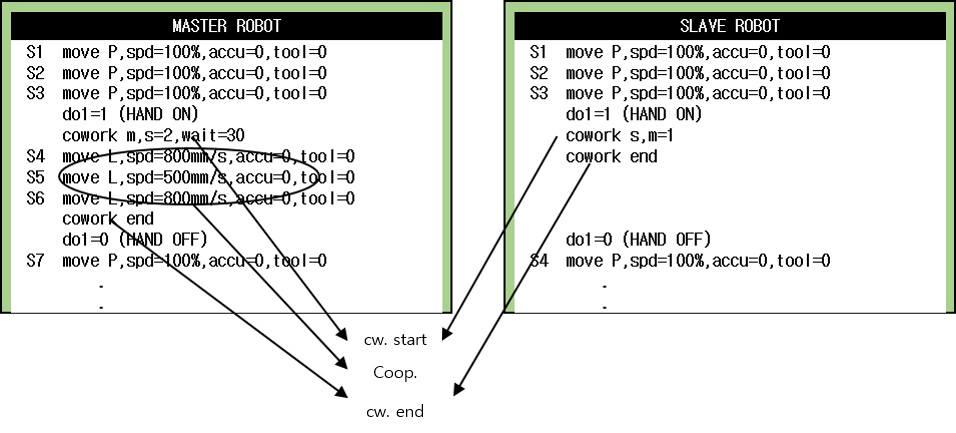
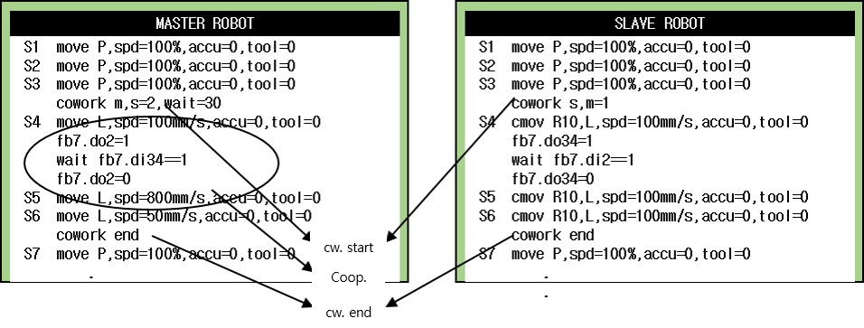

### 4.1.2. 如何使用 `cowork` 命令

(1) 在 MASTER 机器人上，`cowork ~ cowork end` 部分的操作被视为协作段命令。SLAVE 不能插入操作命令。

(2) 在 SLAVE 机器人上，标准 `移动 (move)` 命令不能在协作部分中使用；应使用 `cmov` 命令（协作移动）。

(3) 在处理从属跟随主控的应用时，如下面的示例所示，从属将保持相对主控的位置，并在执行 `cowork` 命令时相应移动，即使从属上没有插入 `cmov` 命令。

(4) 在从属上，您可以插入插值于主控末端执行器坐标系统中的 `cmov` 命令；`cmov` 记录的位置相对于主控的工具末端执行器坐标系统。如果如下面的示例所示进行教学，在 `cowork ~ cowork end` 内，从属执行协作运动，并沿着记录在主控末端执行器坐标系统中的 `cmov` 路径跟随主控的运动。



 - 必须在协作运动的末尾插入 `cowork end` 命令。
 - 对于 SLAVE 机器人，`移动 (move)` 命令不能在协作部分中插入；对于 MASTER 机器人，`cmov` 命令不能插入。

