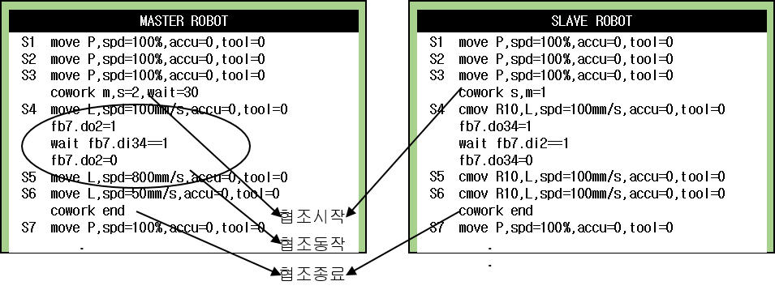

4.1.2. cowork함수의 사용법

(1)	MASTER 로봇에는 cowork ~ cowork end 구간에 있는 동작 명령이 협조 구간 명령이 됩니다. SLAVE는 동작명령을 삽입할 수 없습니다.  

(2)	SLAVE 로봇에는 협조 구간에서 일반 move 명령을 사용할 수 없으며 cowork move 명령인 cmov명령을 사용해야 합니다.  

(3)	슬레이브가 마스터 로봇을 추종하는 역할을 수행하는 핸들링 응용에서는 아래의 예시와 같이 슬레이브에 CMOV명령을 삽입하지 않아도 cowork 명령을 실행할 때 마스터와 슬레이브의 상대위치를 유지하며 이동하게 됩니다.  

 
(4)	슬레이브에는 마스터 엔드 이펙터 좌표계 기준으로 보간 동작하도록 cmov 명령을 삽입할 수 있으며 CMOV의 기록 위치는 마스터의 툴 엔드 이펙터 좌표계 기준입니다. 아래의 예와 같이 교시하면 cowork ~ cowork end 구간 사이에서 협조 동작을 수행하며 마스터 움직임에 따라 슬레이브는 마스터 로봇을 추종하면서 마스터 엔드 이펙터 좌표계로 기록된 CMOV 경로를 따라 움직입니다.  

 



 -	협조 동작 종료 위치에는 반드시 cowork end  명령이 삽입되어 있어야 합니다.  
 -	슬레이브(Slave) 로봇의 경우 협조 구간 내에 MOVE명령은 삽입이 불가하며 마스터(master) 로봇의 경우 CMOV 명령의 삽입이 불가능합니다.

