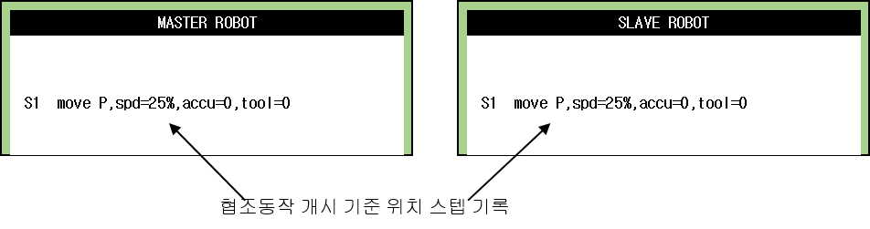
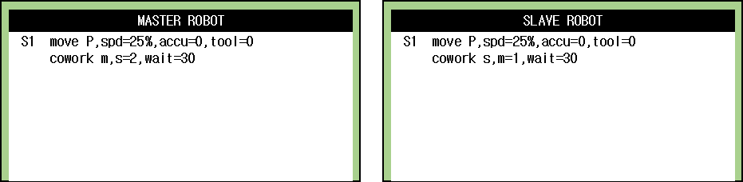
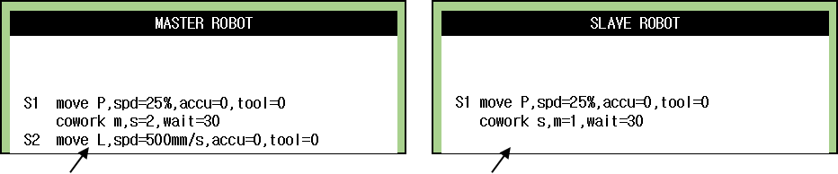
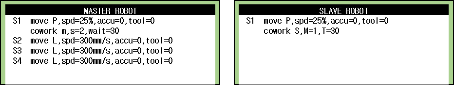
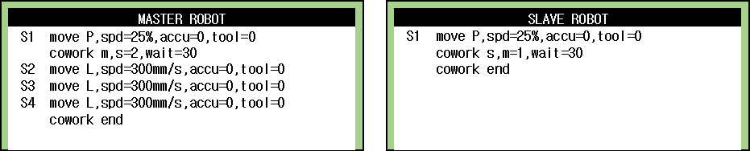

4.2. 협조 핸들링용 프로그램 티칭 및 프로그램 작성

(1)	협조제어 대수만큼의 조작자가 필요합니다. 따라서 조작자는 협조할 로봇 수만큼 참여합니다. 단, TP 공유기를 이용하는 경우 1명의 조작자가 모든 로봇을 동시 제어할 수 있습니다.  

(2)	협조로봇 공통 좌표계 설정이 되어 있는지 확인합니다. 수동 협조 제어 모드전환 기능을 사용자키에 할당합니다.  

(3)	MATER와 SLAVE 로봇을 각각 협조 시작 위치로 이동시키고 기준위치로 시작위치를 기록합니다.  

 
  

![[그림 4-1] 협조동작 개시 기준위치 기록](../_assets/4-1.png)

 

(4)	MASTER와 SLAVE 로봇을 F버튼에 할당한 사용자키를 이용하여 협조 상태(Cooperation Status)로 설정합니다. R351 코드를 입력하여 로봇의 역할을 지정하는 것도 가능합니다.  

(5)	협조제어 개시 명령(cowork M/S)을 등록합니다. cowork 명령은 MASTER/SLAVE 인지를 지정하고 SLAVE/MASTER의 번호를 지정합니다. 이때 MASTER 로봇은 동일 그룹 내 1대만 설정 되어야 하고 SLAVE 로봇은 최대 3대까지 지정할 수 있습니다.   

 
 

(6)	MASTER 로봇을 조그(JOG)로 조작합니다. 이때 SLAVE는 MASTER의 툴끝의 위치를 상대적인 위치로 추종합니다. 협조 조그 시에는 SLAVE도 Enable 스위치를 누르고 있어야 합니다. 기록위치에 스텝을 Master에만 기록합니다. Slave 로봇 제어기에는 기록하지 않습니다.  

 

      

 
![[그림 4-2] Master 로봇 조작](../_assets/4-2.png)

(7)	협조 동작 스텝을 MASTER에 기록합니다. MASTER의 보간 종류 및 속도를 설정합니다. 협조동작 함수 내에서는 일반적인 MOVE 명령을 사용합니다. (SMOV는 사용할 수 없습니다.)  

 

(8)	협조 동작을 마치면 협조 제어를 종료(cowork END)하는 명령을 MASTER와 SLAVE에 삽입합니다.  

 

 

 


	수동 협조 조작 중 Slave의 Enable 스위치 상태를 OFF로 변경하지 마십시오. 하드웨어 신호가 통신신호보다 우선하여 처리되어 협조 로봇간 위치 어긋남이 발생합니다. 이 경우 심하면 작업물이나 로봇 핸드가 파손될 우려가 있습니다. 

