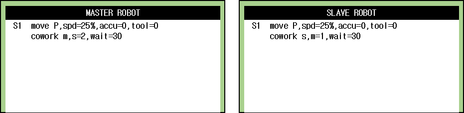
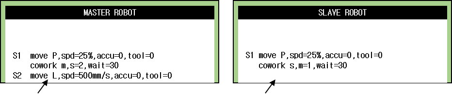
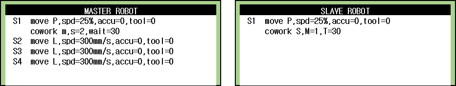
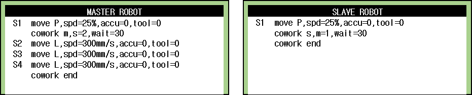

## 4.2. Teaching and Writing Programs for Cooperative Handling

(1) Operators are required equal to the number of cooperative robots; therefore, each operator participates for each robot to be cooperated.

(2) Verify that the cooperative robot common coordinate system is configured.

(3) Move the MASTER and SLAVE robots to their respective cooperation start positions and record the start positions as reference.

 
  

![[Figure 4-1] Recording cooperative motion start reference positions](../_assets/4-1.png)

 

(4) Assign robot roles by entering R351 codes for MASTER and SLAVE robots.

(5) Register the cooperative control start command (`cowork m/s`). The `cowork` command specifies Master/Slave and assigns the Slave/Master numbers. Only one Master may be set, and up to three Slaves may be specified.

 
 

(6) Operate the MASTER robot by jogging (JOG). The Slave follows the Master tool-tip position relatively. During cooperative jogging, the Slave must have the Enable switch pressed. Record step positions only on the Master; do not record them on the Slave controller.

 

      

 
![[Figure 4-2] Master robot operation](../_assets/4-2.png)

(7) Record cooperative motion steps on the MASTER. Set the Master's interpolation type and speed. Use standard `move` commands within cooperative motion commands (cmov cannot be used).

 

(8) When cooperative motion is finished, insert `cowork end` commands on both Master and Slave to end cooperative control.

 

 

 


	Do not change the Slave's Enable switch to OFF during manual cooperative operation. Hardware signals take priority over communication and can cause position mismatches between cooperative robots. In severe cases, this may result in damage to the workpiece or the robot hand.


