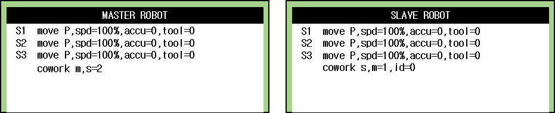
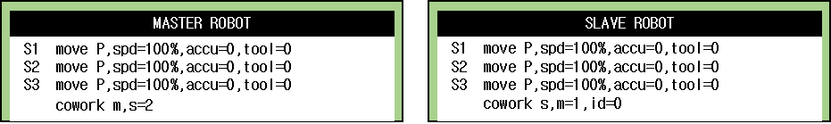
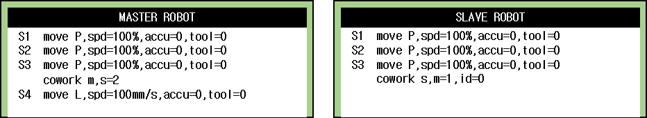
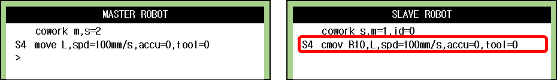
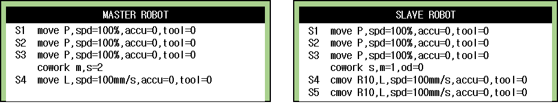
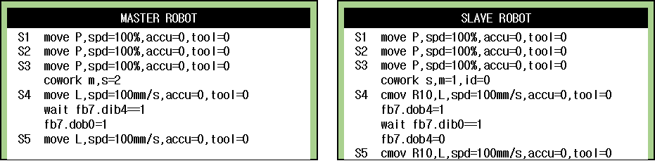
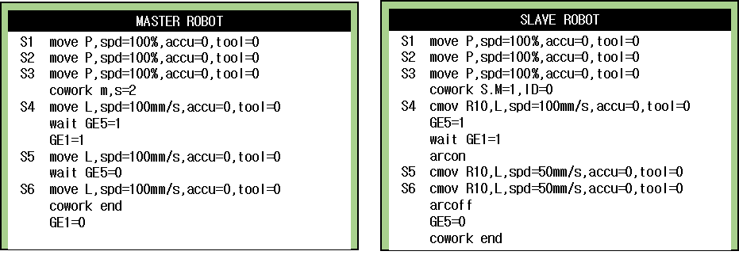
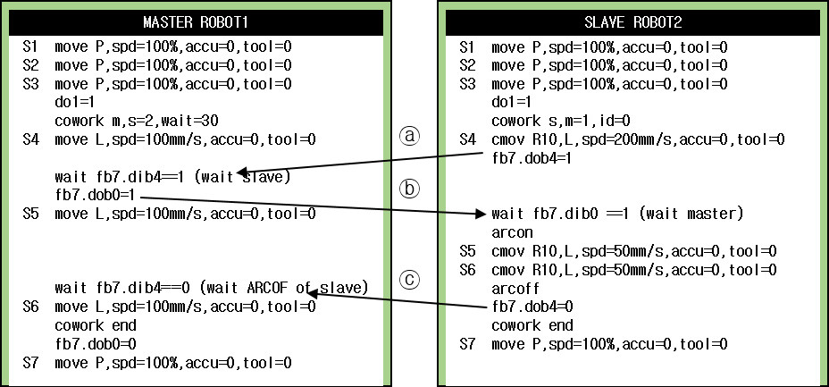
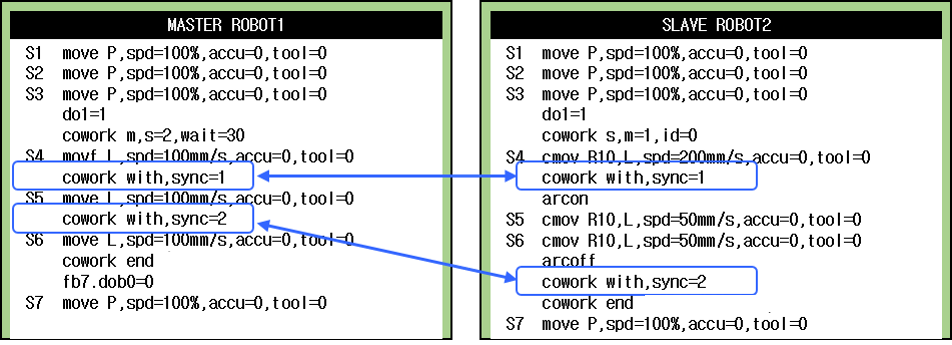

## 4.4. Teaching for Arc Welding and Sealing (Jigless Cooperative Control)

(1) Set the manual cooperative roles of Master and Slave robots to 'Independent', record the start steps for cooperation, and insert the cowork command at the cooperation start position.
 

![[Figure 4-4] Step start and target positions](../_assets/4-4.png)

(2) Set the Manual Cooperative states for Master and Slave according to their roles.

(3) When you jog the Master, the Slave follows. Record the Master step at the desired position.

 

(4) Switch the Slave to cmov recording state using R351,3. The robot role indicator at the top of the screen changes from white to red.

 

(5) Jog the Slave robot to the target position and press the 'Record' key.
 

![[Figure 4-5] Recording cmov target positions](../_assets/4-5.png)

 
  

(6) The cmov positions are recorded on the Slave. The recorded cmov positions are coordinates relative to the Master tool end effector coordinate system. Press the [Properties] key to view or modify the recorded coordinates.
  
(7) The recorded coordinate system will be shown as 'Master'. 

(8) Similarly, move the Slave and record multiple cmov steps.

 

(9) Note that the movement planning for recorded steps is executed separately by Master and Slave, so the timing when Master and Slave reach their target positions may differ. To align the start timings of the Master's move position and the Slave's cmov position in the cooperative section, use mutual interlocks implemented with HiNet I/O or use `cowork with, sync=1`. The `cowork with` command performs synchronized motion only if the sync numbers match; encountering a `cowork with` with a different number will cause an error.

(10) For example, to synchronize the start of step 5 (S5) for Master and Slave, you can use an _mb memory variable to check whether each robot has reached its step position.

 

* Using this method, after Master and Slave reach step 4 (S4), they verify that the partner robot has reached step 4 before moving to the next step (S5).

(11) When cooperative motion is finished, insert `cowork end` commands on both Master and Slave to end cooperative control teaching.

     

(12) The entire program example described above is shown below, and timing control such as ⓐ, ⓑ, ⓒ may be applied for cooperative timing control.

 

(13) The `cowork with` command is used during cooperative control (between `cowork` and `cowork end`) to synchronize positions between Master and Slave. When a `cowork with` command is encountered during cooperative control, it waits until all cooperating robots reach that `cowork with`. Therefore, the earlier program can be modified as follows.

 



 - When using cmov weaving motion, reference points (refp) must be recorded within the cooperative control region (`cowork ~ cowork end`).
 - Seam-tracking of cmov trajectories using laser vision sensors is not supported.
 - In the cooperative control region (`cowork ~ cowork end`), the number of `cowork with` commands must be the same for both Master and Slave.
 - `cowork with` commands performed jointly by cooperating robots must use the same sync number.


