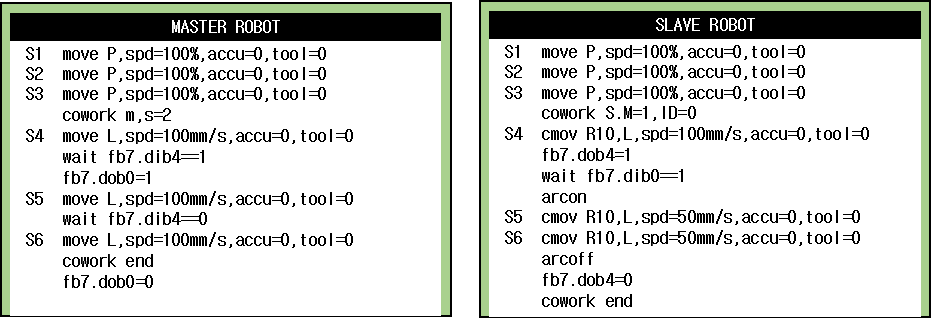
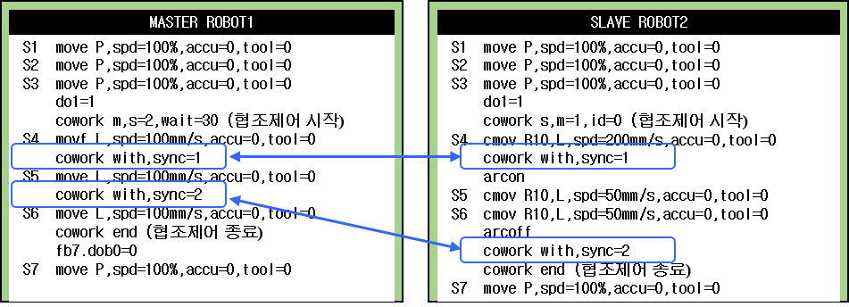

## 4.4. 아크 용접 및 실링용 티칭 (지그리스 협조제어)

(1)	마스터와 슬레이브의 수동 협조 로봇 역할을‘독립’으로 설정한 후 협조시작 위치에 각각의 스텝을 기록 하고 협조 시작 위치에 COWORK 명령을 입력합니다. 
 

![[그림 4-4] 스텝 시작 및 목표 위치](../_assets/4-4.png)

(2)	수동 협조상태 Master와 Slave를 각각의 역할에 따라 지정합니다. 

(3)	Master를 조그 조작하면 슬레이브는 추종하게 됩니다. 원하는 기록위치에 마스터 스텝을 기록합니다. 
 

(4)	Slave를 SHIFT+사용자 키나 R351,3 명령을 이용하여 CMOV기록 상태로 전환합니다. 화면 오른쪽 상단의 로봇역할 표시가 녹색에서 빨간색으로 변경됩니다. 
 

(5)	슬레이브 로봇을 목표위치까지 조그 조작한 후 ‘기록’키를 누릅니다. 
 

![[그림 4-5] 스텝 목표 위치 CMOV 기록](../_assets/4-5.png)

(6)	슬레이브에는 CMOV가 기록됩니다. CMOV의 기록위치는 마스터 툴 엔드 이펙터 좌표계 기준의 좌표입니다. QUICK OPEN키를 눌러 기록된 좌표위치를 확인, 수정이 가능합니다. 
  
(7)	이때 기록된 좌표계는 ‘마스터 엔드’로 표시됩니다. 

(8)	마찬가지 방법으로 슬레이브를 이동하며 여러 개의 CMOV 스텝을 기록할 수 있습니다.
 

(9)	단 기록된 스텝에 대한 이동 계획은 마스터와 슬레이브가 개별적으로 수행하므로 마스터와 슬레이브의 목표 위치에 도달하는 시점은 서로 다를 수 있습니다. 따라서 협조 구간에서 마스터의 MOVE위치와 슬레이브의 CMOV위치의 시작 위치 타이밍을 맞추기 위해서는 HiNet I/O를 이용한 상호 인터록 방법을 사용 하거나 COWORK WITH,SN=1명령을 사용할 수 있습니다. COWORK WITH 명령어는 SN번호가 같아야만 동기 동작을 수행합니다. 다른 번호의 COWORK WITH 명령을 만나면 에러가 발생합니다.

(10)	예를 들어 마스터와 슬레이브의 스텝 5(S5) 시작 시점을 동기화시키기 위해 GE, DE변수를 이용하여 서로 상대가 스텝위치에 도달했는지를 확인하는 방법을 사용할 수 있습니다. 
 

※ 위와 같은 방법을 사용하면 마스터와 슬레이브가 스텝 4(S4)에 도달한 후 상대 로봇이 스텝 4까지 도달했는지 확인하고 다음 스텝(S5)로 이동하게 됩니다. 

(11)	협조 동작을 마치면 협조 제어를 마치도록 마스터와 슬레이브에 모두 COWORK END 명령을 삽입하면 협조제어 교시가 완료됩니다. 
     

(12)	앞에서 설명한 전체 프로그램은 다음과 같으며 협조제어의 타이밍 제어를 위해 ⓐ, ⓑ, ⓒ와 같은 타이밍 제어를 실시할 수 있습니다. 
 

(13)	COWORK WITH 명령은 협조제어 중(COWORK~COWORK END사이)에서 마스터와 슬레이브 로봇간에 위치를 동기화할 때 사용하는 명령입니다. 협조제어 중에 COWORK WITH명령을 만나게 되면 협조 중인 로봇이 모두 COWORK WITH에 도달할 때까지 대기합니다. 따라서 이전의 프로그램은 다음과 같은 방법으로도 변경할 수 있습니다. 
 



 -	CMOV의 위빙동작을 사용하는 경우 참조점(PREP)은 협조제어 구간(COWORK ~ COWORK END) 내에 기록해야 합니다. 
 -	레이저 비전 센서를 이용한 CMOV궤적 Seam-Tracking 기능은 지원하지 않습니다.
 -	COWORK WITH명령은 협조제어 구간에서(COWORK~COWORK END) 마스터와 슬레이브 모두 동일한 개수만큼 사용해야 합니다. 
 -	협조 로봇들이 함께 수행하는 COWORK WITH 명령어는 동일한 SN번호를 사용해야 합니다.


 
