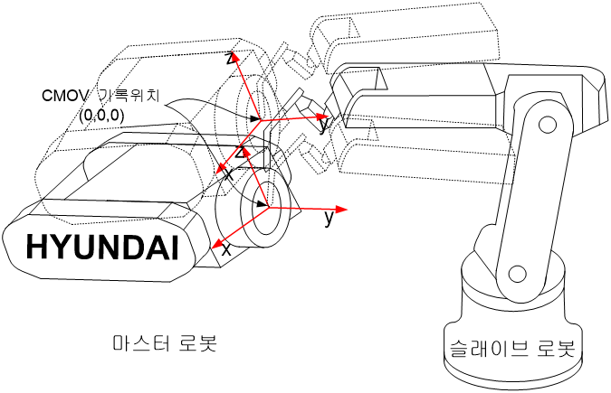

## 4.5. CMOV 기록 위치 확인

CMOV 스텝은 CMOV기록 모드에서 스텝 전 후진 기능을 이용하여 티칭 위치를 확인 할 수 있는 유용한 기능입니다. CMOV 스텝은 ‘마스터 엔드’ 이펙터 좌표계 기준의 위치와 자세가 기록되므로 마스터의 툴 위치를 확인하고 실행하여야 합니다.  

 - (1)	마스터로 티칭된(COWORK M) 로봇을 수동 협조 상태를 마스터 상태로 설정합니다. (R351,1)  
 - (2)	슬레이브로 티칭된(COWORK S) 로봇을 CMOV기록 상태로 설정합니다. (R351,3)  
 - (3)	마스터 로봇을 협조할 스텝 위치로 이동시킨 후 정지된 상태로 놓습니다.  
 - (4)	슬레이브는 이동할 CMOV 스텝을 선택하고 스텝 전진 키를 누르면 마스터 엔드 이펙터 위에 기록된 위치로 이동합니다. 예를 들어 아래의 그림처럼 CMOV 기록위치가 마스터 엔드 이펙터 좌표계의 원점(0,0,0)에 기록되어 있다면 마스터 로봇이 어느 위치에 있어도 슬레이브 로봇은 CMOV 실행 시 마스터 엔드 이펙터의 원점으로 이동합니다.  

 


 -	CMOV 기록 상태(R351,3 상태)에서는 COWORK 명령의 실행 여부에 상관없이 해당 스텝위치로 이동합니다.  
 - 	CMOV 기록 상태에서 마스터의 조그는 불가합니다.  
 -	CMOV 기록 상태에서는 실시간 협조동작을 하지 않기 때문에 마스터를 동시에 스텝 전 후진 조작하지 말고 정지 상태로 놓으십시오.  
 -	CMOV 기록 상태 마스터의 위치를 변경한 후 정지 시킨 후 CMOV 스텝을 스텝 전진하면 갱신된 위치로 이동합니다  
