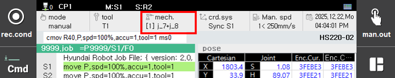
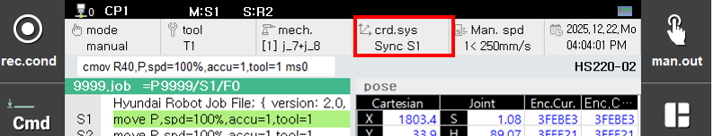

### 4.6.1. 位置器主控手动操作

 

(1) 对安装有位置器的机器人执行位置器组设置和位置器校准，以启用位置器同步。

(2) 使用 R351,1 或用户钥匙将带有位置器的机器人设置为手动协作主控 (M:G#R#)。

(3) 按下 '机制' 按钮以选择位置器机制。

(4) 按下 '坐标系统' 按钮，以便选择同步坐标系统 S1 (或 S2)。

(5) 使用 R351,2 (S:G#R#) 将从属机器人设置为 SLAVE。

(6) 在执行位置器同步手动操作时，机器人 1 和机器人 2 与位置器同步操作。