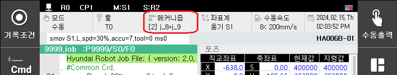

## 4.6.1. 포지셔너 마스터 조그

 

(1)	포지셔너가 설정되어 있는 로봇에 포지셔너 동기 기능을 위한 포지셔너 그룹 설정 및 포지셔너 캘리브레이션 등을 수행합니다. 

(2)	R351, 1혹은 사용자키를 이용하여 마스터로 설정할 포지셔너가 설정되어 있는 로봇을 수동 협조 마스터(M:G#R#)로 설정합니다. 

(3)	‘메커니즘’ 키를 눌러 포지셔너 메커니즘을 선택합니다.

(4)	‘좌표계’ 키를 눌러 동기좌표계 S1(혹은 S2)이 선택되도록 합니다.
 

(5)	슬레이브 로봇은 R351,2를 이용하여 SLAVE로(S:G#R#) 역할을 설정합니다. 

(6)	포지셔너 동기 조그 동작을 실시하면 로봇 1과 로봇 2가 모두 포지셔너와 동기로 조작됩니다. 
