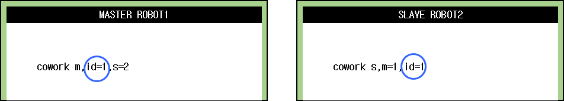
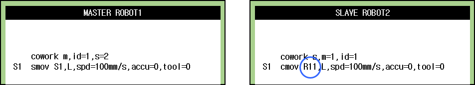
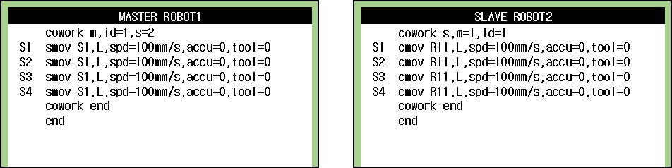
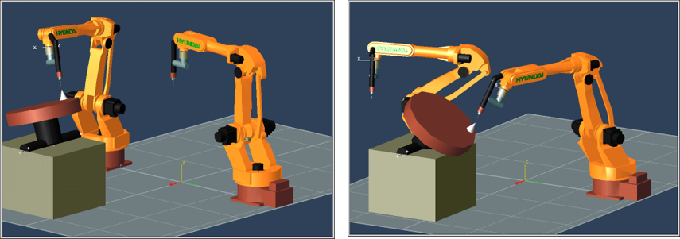

## 4.6.2. 포지셔너 마스터 티칭과 재생

COWORK 명령을 이용하여 마스터와 슬레이브에 교시합니다. 슬레이브 측은 마스터 측의 포지셔너를 마스터로 선택하기 위해 ID=1(포지셔너 그룹 번호)로 설정합니다. 

포지셔너를 마스터로 설정한 상태(마스터 로봇측 좌표계 ‘동기 S1’)에서 슬레이브의 위치를 기록합니다. 이때 기록 위치는 포지셔너 엔드 이펙터 좌표계로 기록됩니다. 

 

마스터 로봇이 포지셔너와 협조하기 위해서는 기존의 포지셔너와 동일한 방법으로 SMOV스텝으로 교시합니다. 슬레이브 로봇은 마스터 로봇의 포지셔너를 마스터로 설정한 상태(마스터 로봇측 좌표계 ‘동기 S1’)에서 스텝을 기록하면 마스터 ID를 반영한 로봇번호로 기록됩니다. 

 

마스터는 포지셔너 동기기능과 동일하고 슬레이브는 R11으로 기록됩니다.

상기의 (3)과 동일한 방법으로 마스터와 슬레이브를 티칭하고 COWORK END로 마무리 합니다. 
     

수동 모드에서 동작 확인 후 자동모드에서 운전합니다. 

    

 



 -	지그리스 협조제어에서 포지셔너 그룹은 1~2를 지원합니다. 포지셔너 조그, CMOV에서 포지셔너 그룹 번호를 1 혹은 2로 선택해야 합니다.  
 -	슬레이브에서 COWORK S,M=#1,ID=#2에서 설정한 값과 CMOV R#1#2값이 다를 경우 『E1365 CMOV 마스터 No. ID가 부적절함.』 에러가 발생합니다.  

