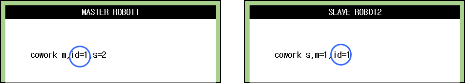
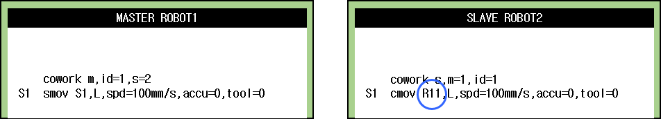
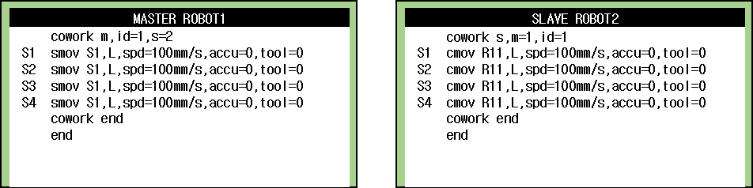

## 4.6.2. Positioner Master Teaching and Playback

Teach Master and Slave using the `cowork` command. On the Slave side, set `id=1` (positioner group number) to select the Master's positioner as Master.

While the positioner is set as Master (Master robot coordinate system 'Sync S1'), record the Slave positions. Recorded positions are stored in the positioner end effector coordinate system.

 

To have the Master robot cooperate with the positioner, teach smov steps in the same way as for an ordinary positioner. When the Slave records a step while the Master's positioner is set as Master (Master robot coordinate system 'Sync S1'), it is recorded using a robot number that reflects the Master ID.

 

The Master uses the same positioner synchronization function, and the Slave is recorded with R11.

Teach Master and Slave in the same way as described in (3) above and finish with `cowork end`.
     

After confirming operation in manual mode, operate in automatic mode.

    
![[Figure 4-7] Simulation of positioner synchronized operation per robot](../../_assets/4-9.png)

 



 - Jigless cooperative control supports positioner groups 1-3. When positioner jogging or in `cmov`, select the positioner group number 1-3.
 - If values set in the Slave with `cowork s,m=#1,id=#2` differ from the `cmov R#1#2` values, an `E1365 cmov Master No. ID is invalid.` error occurs.


