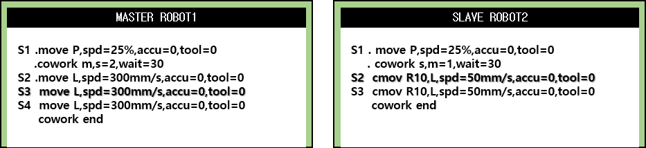

## 5.2. 수동모드에서 프로그램 확인

(1)	수동모드에서 마스터 로봇은 수동 협조 상태를 I(Indiv.)나 M(Master)로 설정하고, 슬레이브 로봇은 수동 협조 상태를 I(Indiv.)나 S(Slave)로 설정합니다.  
(2)	운전 준비를 On 하고 양측 모두 ‘스텝 전진’키를 누릅니다.  
(3)	마스터와 슬레이브의 동기 동작을 확인하기 위해서 마스터와 슬레이브의 스텝전진 키를 협조 동작이 종료될 때까지 누릅니다.  
 
  
 

![[그림 5-5] 수동모드에서 프로그램 확인](../_assets/5-5.png)

 
 


 
 - 	슬레이브가 cmov기록 모드이면 마스터와의 수동 모드 협조 동작이 되지 않습니다.  
 - 	스텝 전후진 실행 시 조건설정의 ‘스텝 전진시 펑션 실행’을 On으로 설정해야 합니다.  
 -	마스터와 슬레이브 로봇은 cowork 명령을 실행하는 순간만 실행 위치를 검사하며 그 이외의 구간에서 마스터와 슬레이브의 스텝위치를 동기화 시키지는 않습니다. 따라서 스텝 전 후진으로 확인한 마스터와 슬레이브의 상대 위치는 자동모드 재생 동작에서는 달라질 수 있습니다.   
 - 	두 로봇의 위치를 동기화 하기 위해서는 cowork with,sync=1 명령문을 사용하십시오.


