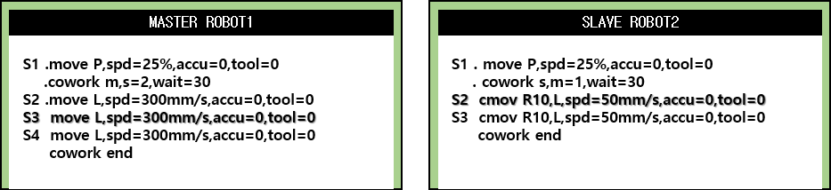

## 5.2. 手动模式下的程序检查

(1) 在手动模式下，将主机器人（Master）的手动协作状态设置为 I (Indiv.) 或 M (Master)，并将从机器人（Slave）的手动协作状态设置为 I (Indiv.) 或 S (Slave)。  
(2) 打开驱动就绪并同时按下两侧的“前进”键。  
(3) 按下主机器人和从机器人的前进键，直到协作运动完成，以验证主从机器人的同步运动。  

 

![[图 5-5] 手动模式下的程序检查](../_assets/5-5.png)

 



 - 如果从机器人处于 cmov 录制模式，则无法与主机器人进行手动模式协作操作。  
 - 在执行前进/后退时，将条件设置中的“在前进时执行功能”设置为开启。  
 - 主机器人和从机器人仅在执行协作命令的瞬间检查执行位置；在此之外，它们不会同步主从机器人的步骤位置。因此，在自动模式播放期间，使用前进/后退检查的主从机器人的相对位置可能会有所不同。  
 - 要同步两个机器人的位置，请使用 `cowork with, sync=1` 语句。  

