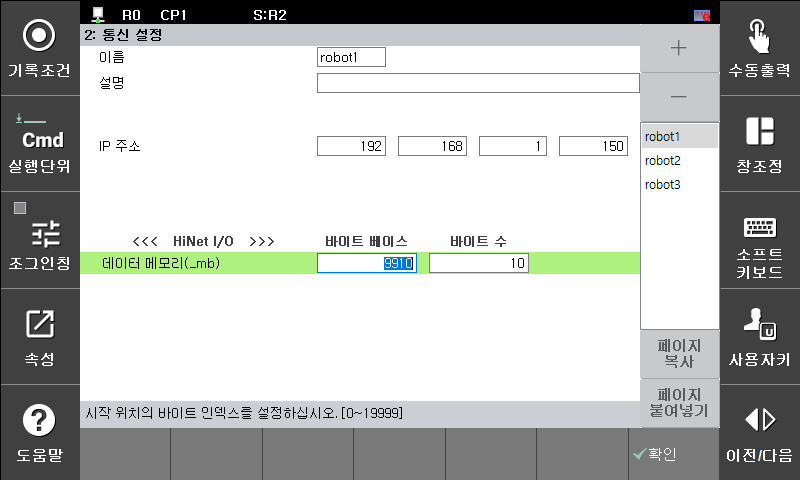

## 6.1. HiNet I/O 개요

HiNet I/O는 협조제어 전용 네트워크를 통해 I/O를 공유하는 기능입니다. 각 제어기는 협조로봇 간의 신호를 모니터링하고 있으므로 공유로 설정되어 있는 부분을 I/O로 할당하여 자유롭게 입출력으로 사용할 수 있습니다. 각 제어기가 사용할 수 있는 Output 크기는 4byte이고 자신의 출력 부분을 제외한 124byte를 수신할 수 있습니다. 협조제어와는 달리 HiNet I/O는 동일 그룹뿐 아니라 HiNet 네트워크에 연결된 다른 그룹의 로봇에서도 최대 12대까지 신호를 송수신 할 수 있습니다.  
 

![[그림 6-1] HiNet 그룹 구조 ](../_assets/6-1.png)

이 기능은 로봇언어(HR-BASIC)을 이용하여 신호의 입출력 검출뿐 만 아니라 변수로도 사용이 가능하기 때문에 사용자의 욕구에 부합하는 다양한 응용에 사용이 가능합니다.  

 
![[그림 6-2] HiNet I/O 사용 예시(그룹 1번 – 로봇 4대) ](../_assets/6-2.png) 

DE는 bit단위의 신호입니다. GE는 8개의 DE신호를 byte 단위로 묶은 신호 입니다. 따라서 0~255까지의 범위내에서 신호를 입출력할 수 있습니다.  

협조제어 그룹 번호에 대한 개별 로봇 제어기의 GE신호 출력 범위는 아래와 같습니다.  
 - 최소 GE = { (G#-1)X4 + (R#-1) }X4 + 1 
 - 최대 GE = { (G#-1)X4 + (R#-1) }X4 + 4 

 

[표 6-1] 로봇 번호에 따른 출력/입력 영역  

 