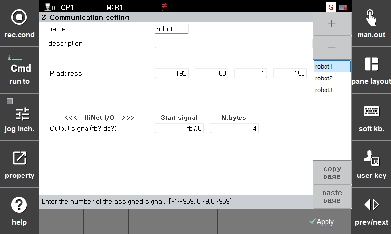

## 6.1. HiNet I/O 概述

HiNet I/O 是一个通过协作控制网络在机器人之间共享信息的功能。每个控制器监控来自协作机器人的信息，因此设置为共享的部分可以自由使用。每个控制器可以使用的最大数据大小为 12 字节，并且可以接收 36 字节（不包括其自身部分）。
 

![[Figure 6-1] HiNet Group Structure](../_assets/6-1.png)

此功能可以通过机器人语言 (HRScript) 使用，允许满足用户需求的各种应用。

 

 

例如，如果配置如下，当 ROBOT 1 是本地机器人时，其信息设置为 fb7.dob0 ~ fb7.dob3，ROBOT2 的信息在 fb7.dib4 ~ fb7.dib7 接收，ROBOT3 的信息在 fb7.dib8 ~ fb7.dib11 接收，ROBOT4 的信息在 fb7.dib12 ~ fb7.dib15 接收。

<如果您的机器人是 ROBOT 1>

| Robot No. | Start Signal | Byte Count | Note |
| :---: | :---: |  :---: | :---: | 
| ROBOT 1 | fb7.0 | 4 | 输出 (fb7.dob0 ~ fb7.dob3) |
| ROBOT 2 | fb7.32 | 4 | 输入 (fb7.dib4 ~ fb7.dib7) |
| ROBOT 3 | fb7.64 | 4 | 输入 (fb7.dib8 ~ fb7.dib11) |
| ROBOT 4 | fb7.96 | 4 | 输入 (fb7.dib12 ~ fb7.dib15) |

![[Figure 6-2] HiNet I/O 使用示例 (组 1 - 4 个机器人)](../_assets/6-2.png)