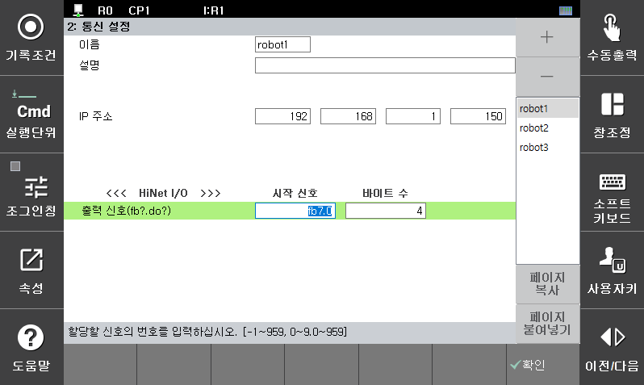

## 6.1. HiNet I/O 개요

HiNet I/O는 협조제어 네트워크를 통해 로봇간의 정보를 공유하는 기능입니다. 각 제어기는 협조로봇 간의 정보를 모니터링하고 있으므로 공유로 설정되어 있는 부분을 자유롭게 사용할 수 있습니다. 각 제어기가 사용할 수 있는 데이터의 최대 크기는 12byte이고 자신의 부분을 제외한 36byte를 수신할 수 있습니다.  
 

![[그림 6-1] HiNet 그룹 구조 ](../_assets/6-1.png)

이 기능은 로봇언어(HRScript)을 이용하여 사용이 가능하기 때문에 사용자의 욕구에 부합하는 다양한 응용에 사용이 가능합니다.  

 

 

예를들어 하기와 같이 설정된 경우 ROBOT 1인 경우에 자신의 정보를 _mb9910 ~ _mb9919 에 설정하고, ROBOT2의 정보를 _mb9920 ~ _mb9929, ROBOT3의 정보를 _mb9930 ~ _mb9939, ROBOT3의 정보를 _mb9940 ~ _mb9949에 수신하게 됩니다.   

| 로봇 번호 | 바이트 베이스 | 바이트 수 |
| :---: | :---: |  :---: | 
| ROBOT 1 | 9910 | 10 |
| ROBOT 2 | 9920 | 10 |
| ROBOT 3 | 9930 | 10 |
| ROBOT 4 | 9940 | 10 |

![[그림 6-2] HiNet I/O 사용 예시(그룹 1번 – 로봇 4대) ](../_assets/6-2.png) 
