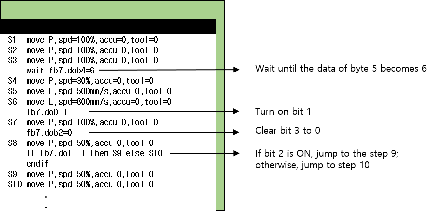

## 6.2. Examples

It is not possible to list all applications that can be implemented with the robot language, but a simple example application is shown in the following figure. Because input/output signals can be used, it has the advantage of supporting various applications.

