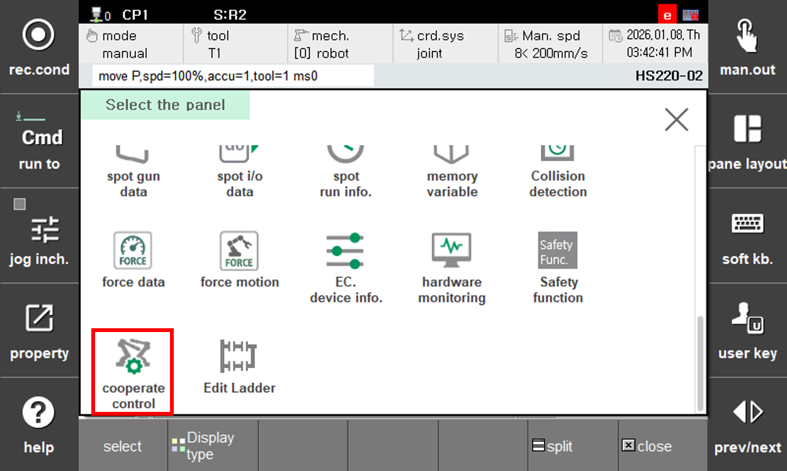
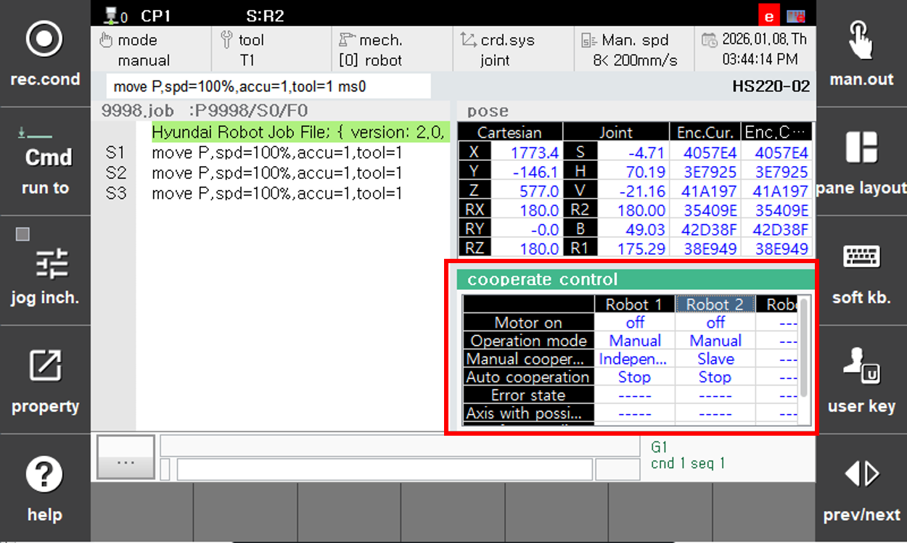
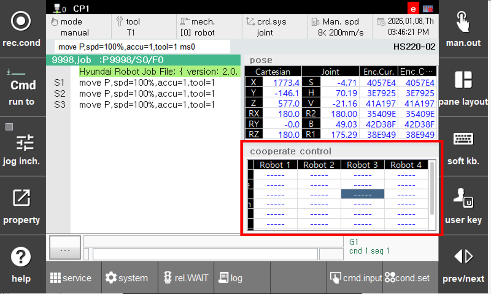

## 8.1. Cooperative Control Status Monitor

(1) Select 'Inter-robot Cooperative Control' from 'Window Settings' → 'Selection'.
 
 

(3) The cooperative control status is displayed as follows.

 

(4) Each item in the monitoring function has the following meanings.

 - Motor ON: Indicates the drive-ready state of each robot. (on/off)
- Operation Mode: Indicates whether each robot is set to manual mode or automatic mode. (Manual/Automatic)
- Manual Cooperation: Displays the manual cooperative state of each robot.
    - Independent: Individual jog state
    - Master: Cooperative jog state, MASTER specified
    - Slave: Cooperative jog state, SLAVE specified
- Automatic Cooperation: Displays the cooperative state during robot playback.
    - Stop: Robot is not running
    - Individual: Performing individual robot playback actions
    - Waiting: Waiting in the cowork command for the partner robot to reach the cooperation position
    - Cooperation: During cooperative playback
- Error State: Shows the recent error state of each robot. Cleared upon startup
- Potential Interference Axis: The axis of the robot closest to the partner robot
- Interference Distance [mm]: Distance between potential interference axes


If cooperative control is set to <Disabled> in the cooperative control parameters, monitoring information will not be displayed.


