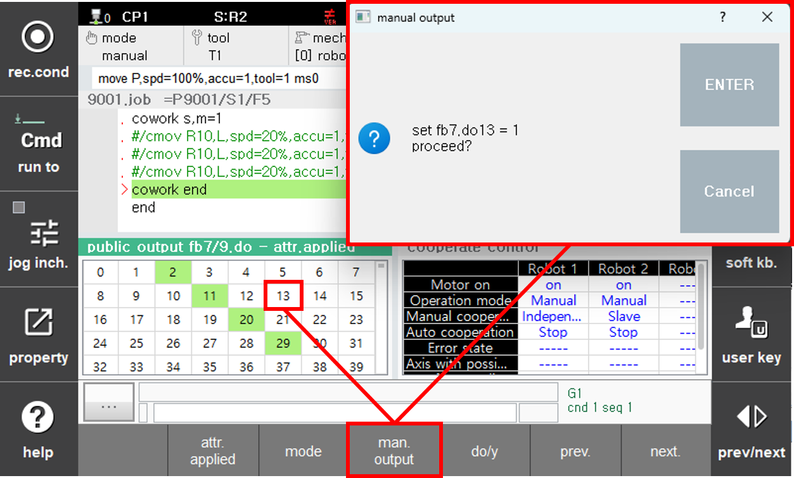

## 8.3. Manual Output Function

You can manually change your robot's cooperative control status.

- Display the 'General Output' window from 'Window Settings' → 'Selection'.
- Move to the output signal corresponding to your robot number that you want to change manually.
- Press the 'Manual Output' button and change it in the dialog that appears.

