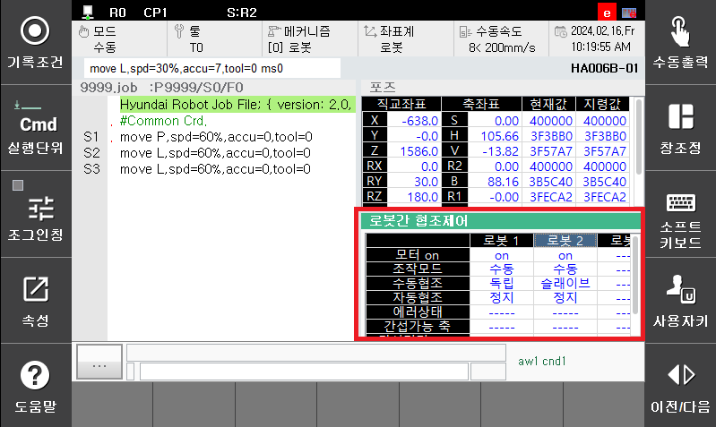

## 9.1. 협조제어 상태 모니터

(1)	『서비스』 → 『1: 모니터링』 → 『10: 협조제어 데이터』를 선택합니다.
 

(2)	『1:  협조제어 상태』를 선택합니다.  

 

(3)	협조제어 상태가 다음과 같이 표시됩니다.  

 

(4)	모니터링 기능의 각 항목은 다음의 의미를 가집니다.

 - 모터 ON: 각 로봇의 운전 준비 상태를 표시합니다. (ON/OFF)
- 조작모드: 각 로봇이 수동모드로 설정되어 있는지 자동모드로 설정되어 있는지를 표시합니다. (수동/자동)
- 수동협조: 각 로봇의 수동모드의 협조 상태를 표시합니다. 
    - Individual: 개별 조그 상태 
    - Master: 협조 조그 상태, MASTER 지정 
    - Slave: 협조 조그 상태, SLAVE 지정 
- 자동협조: 로봇 재생시의 협조 상태를 표시합니다. 
    - 정지: 로봇이 기동중이 아님 
    - 독립: 개별적인 로봇 재생 동작을 수행중 
    - 대기: cowork 명령에서 상대의 로봇이 협조 위치가 되기를 대기하는 중 
    - 협조: 협조 재생 중 
- 에러상태: 각 로봇의 최근 에러 상태를 표시. 기동시에 클리어 됨 
- 간섭가능 축: 상대로봇과 가장 가까운 거리를 갖는 자신 로봇의 축 이름
- 간섭거리[mm]: 간섭가능 축간의 거리


협조제어 파라미터에서 협조제어가 <무효>로 설정되어 있으면 모니터링 정보가 표시되지 않습니다.  

