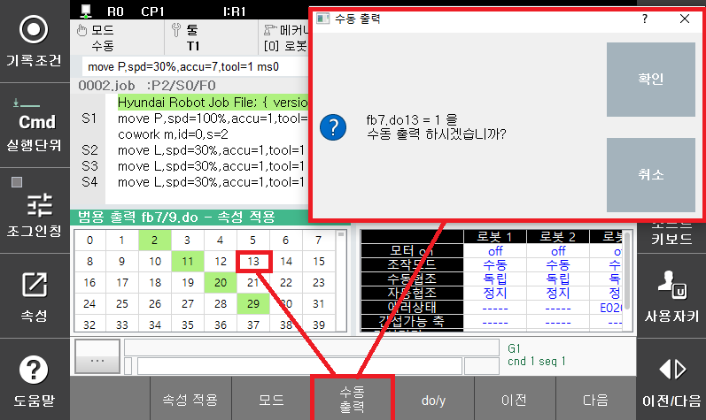

## 9.3. 수동출력 기능

협조 제어용 HiNet I/O 신호를 수동으로 출력할 수 있습니다. 

- 수동모드에서 티치펜던트 화면의 우측 상단 [수동출력] 버튼을 누르면 수동출력 대화상자가 출력됩니다.
- 분류 항목에서 출력하고자 하는 HiNet I/O 항목을 DE/GE 중 선택합니다.
- 자신의 로봇번호에서 출력 가능한 DE/GE 번호를 인덱스 항목에 입력합니다.
- DE의 경우 0, 1중 출력할 값을 선택 후 ‘적용’ 버튼을 누릅니다.
- GE의 경우 해당 byte에 출력할 값을 0~255 중 선택 후 ‘적용’ 버튼을 누릅니다.
- 현재값 항목이 새 값 항목과 동일한 값으로 변경되었는지 확인합니다.

